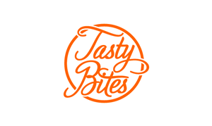

<!DOCTYPE html>
<html lang="en">
<head>
  <meta charset="UTF-8" />
  <title>About Us - TastyBites</title>
  <link rel="stylesheet" href="style.css" />
</head>
<body>
  <header>
    

      
      <h1>TastyBites</h1>
    

    <nav>
      <a href="index.html">Home</a>
      <a href="menu.html">Menu</a>
      <a href="gallery.html">Gallery</a>
      <a href="contact.html">Contact</a>
    </nav>
  </header>

  <section class="hero">
    <h2>Our Story</h2>
    
TastyBites started in 2020 with one goal: to make delicious, heartwarming food accessible to everyone.

  </section>

  <section class="about-section">
    <h3>Why Choose Us?</h3>
    <ul>
      <li>✅ Fresh ingredients daily</li>
      <li>✅ Passionate chefs & staff</li>
      <li>✅ Affordable, tasty food</li>
    </ul>
  </section>

  

  <section class="owner-section">
  

    
    

      <h2>Meet Our Founder</h2>
      <h3>Uswa khan</h3>
      

        Uswa Khan, the passionate founder of TastyBites, started this journey with a dream to bring homemade flavor to the world.
        With a background in culinary arts and years of dedication, she turned a small kitchen into a beloved local brand.
      

      

        “Every dish we serve is made with love, care, and the finest ingredients. Our customers are family.”
      

    

  

</section>

  <footer>
    
&copy; 2025 TastyBites. All rights reserved.

  </footer>
</body>
</html>
